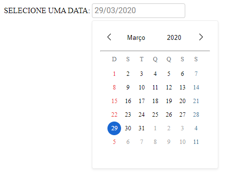

# datepickerJS

### A implementação de um calendário feita com javascript, css e html puramente

### Como instalar
* Clone ou Baixe os arquivos deste projeto

### Como executar
* Crie uma tag input e adicione um atributo 'datepicker'

* Será necessário um servidor para rodar o calendário. Devido a restrição de CORS, o browser não permitirá que o projeto seja exibido sob o protocolo file. Em ambiente de desenvolvimento, um servidor sugerido é o http-server do NodeJs, que pode ser instalado a partir do comando abaixo:

``npm install http-server -g``

* Após instalado, execute em um terminal, no diretório do seu projeto o comando abaixo:

``http-server``

* um servidor será aberto na porta 8080 em localhost

* Ao clicar no input, o datepicker será exibido

### Próximas implementações

* Adição do número da semana
* Ao clicar no ano, exibir um seletor para a faixa dos anos que estão em seleção
