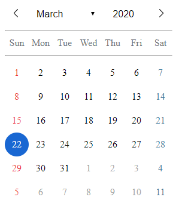

# Calendar-JS

### A implementação de um calendário feita com javascript, css e html puramente

### Como instalar
* Clone ou Baixe os arquivos deste projeto
* Será necessário um servidor para rodar o calendário. Devido a restrição de CORS, o browser não permitirá que o projeto seja exibido sob o protocolo file. Em ambiente de desenvolvimento, um servidor sujerido é o http-server do NodeJs, que pode ser instalado a partir do comando abaixo:
``npm install http-server -g``
* Após instalado, navegue um terminal até o diretório que contém o index.html e execute o comando:
``http-server``
* um servidor será aberto na porta 8080 em localhost

### Próximas implementações

* Marcação diferenciadas das datas que são feriados nacionais
* Criação de interface para adição de compromissos e lembretes
