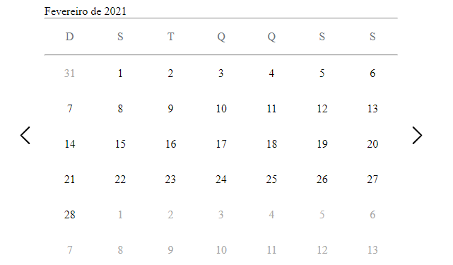

# Calendar-JS

### Uma implementação de um calendário feita com javascript, css e html puramente

### Próximas implementações

* Pesquisa por período
* Criação de compromissos
* Marcação do dia atual
* Integração com api de feriados do igbe
